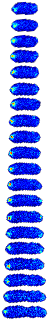

# Next-Frame Prediction using ConvolutionalLSTM
CSE 599 Final Project - Olivia Thomas and Daniela Koch

## Data 

The data used in this project is part of a publicly available set of 

The images in were segmented using the SuperSegger[[1]](#1) software created by the Wiggins lab. The software and full documentation for the image segmentation can is publicly available and can be found here: https://github.com/wiggins-lab/SuperSegger/wiki. 

## References
<a id="1">[1]</a> 
Stylianidou, S., Brennan, C., Nissen, S.B., Kuwada, N.J. and Wiggins, P.A. (2016), SuperSegger: robust image segmentation, analysis and lineage tracking of bacterial cells. Molecular Microbiology, 102: 690-700. https://doi.org/10.1111/mmi.13486

