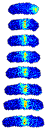
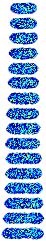

# Next-Frame Prediction using ConvolutionalLSTM
CSE 599 Final Project - Olivia Thomas and Daniela Koch

## background on cell stuff

It has been observed that the proteins within E.coli exhibit time dependent structure.  Some of these proteins have been studied in detail, and it has been found that the observed structure is directly related to their function within the cell.  For example, the protein ftsZ can be found in highest concentrations at the middle of the cell, where it is responsible for the mechanics of cell division [[2]](#2).  We can gain intuition about proteins with unknown function by comparing their dynamical structure throughout the cell to thoseof proteins with known functions.

- show example of consensus time dependence, now interested in single cell stuff, which is why we are interested in doing this with neual networks
- can we predict cell death? 
- can we predict mutations? 
- which protein dynamics are most indicative of cell health? 

## what is next frame prediction, how does it work?

### Background on ConvLSTM

## More detailed problem overview 

### Data 

The data used in this project is part of a publicly available set of 

The images in were segmented using the SuperSegger[[2]](#2) software created by the Wiggins lab. The software and full documentation for the image segmentation can is publicly available and can be found here: https://github.com/wiggins-lab/SuperSegger/wiki. 

  *Fig. 1: FtsZ*    

 
  

<figure>
  
  <figcaption>Caption text</figcaption>
</figure>

### Data Preprocessing
After segmentation (make all lifecycles same length, cells same size, etc)
Do this to make it easier for network to learn the thing we actually care about, which is the internal dynamics 

## References
<a id="1">[1]</a> 
Kuwada, N.J., Traxler, B. and Wiggins, P.A. (2015), Protein localization dynamics in bacteria. Molecular Microbiology, 95: 64-79. https://doi.org/10.1111/mmi.12841

<a id="1">[2]</a> 
Stylianidou, S., Brennan, C., Nissen, S.B., Kuwada, N.J. and Wiggins, P.A. (2016), SuperSegger: robust image segmentation, analysis and lineage tracking of bacterial cells. Molecular Microbiology, 102: 690-700. https://doi.org/10.1111/mmi.13486

