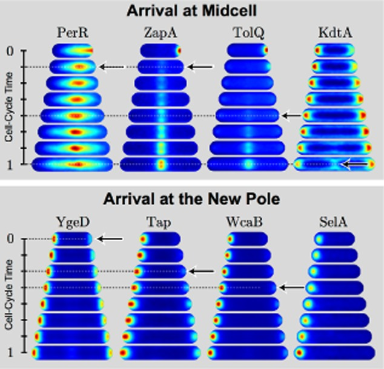
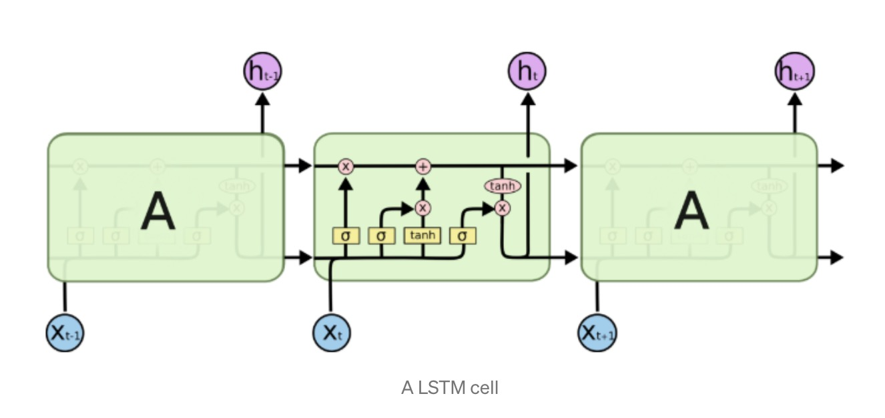
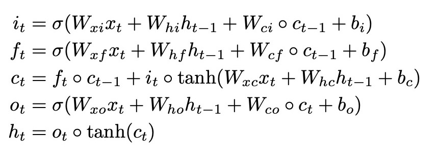
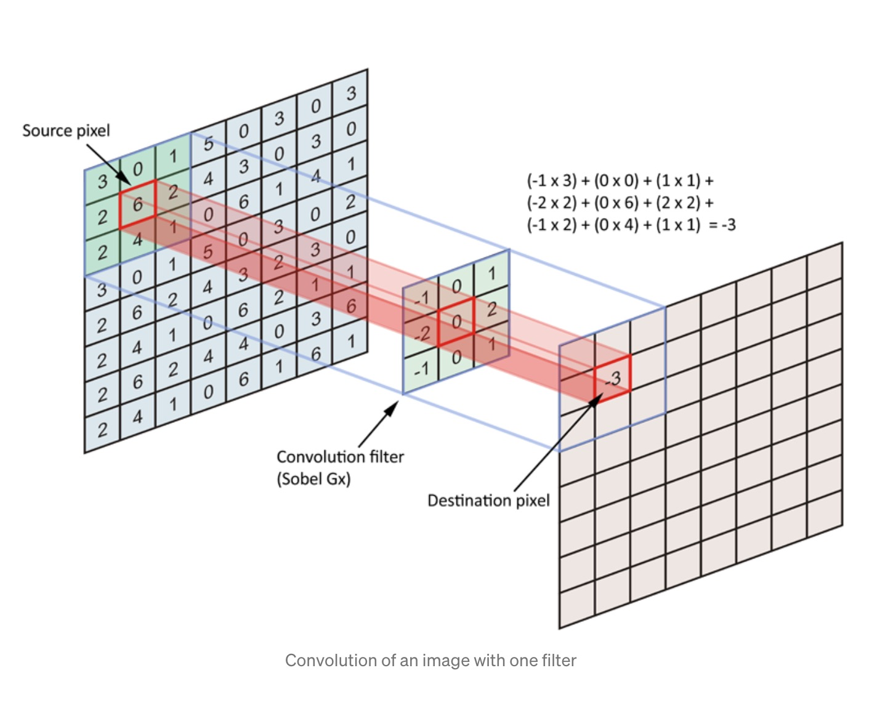
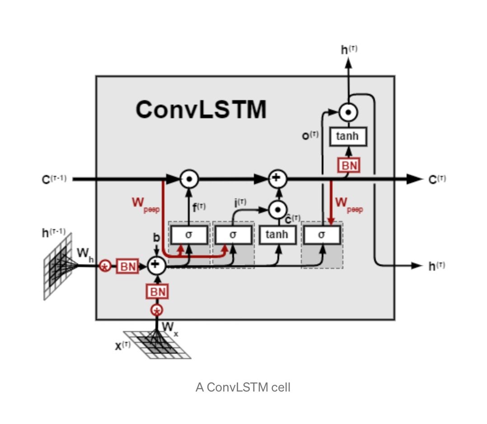
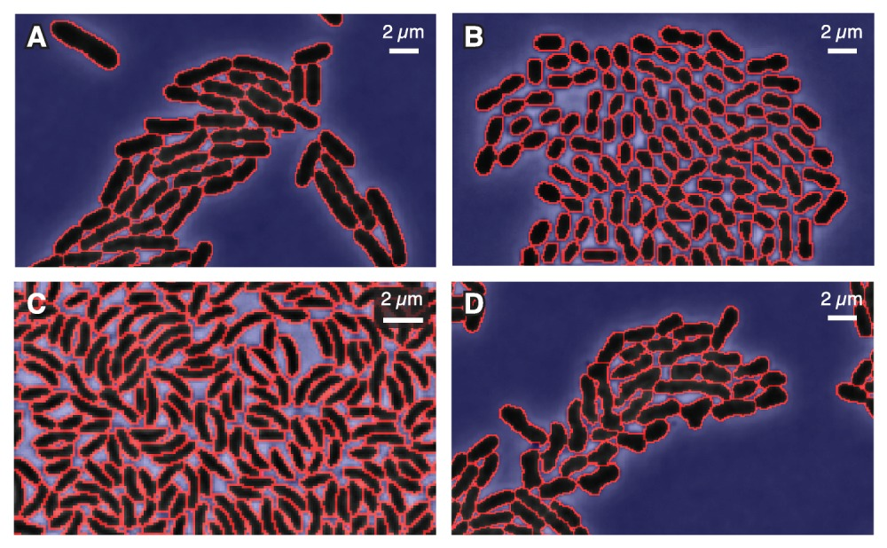
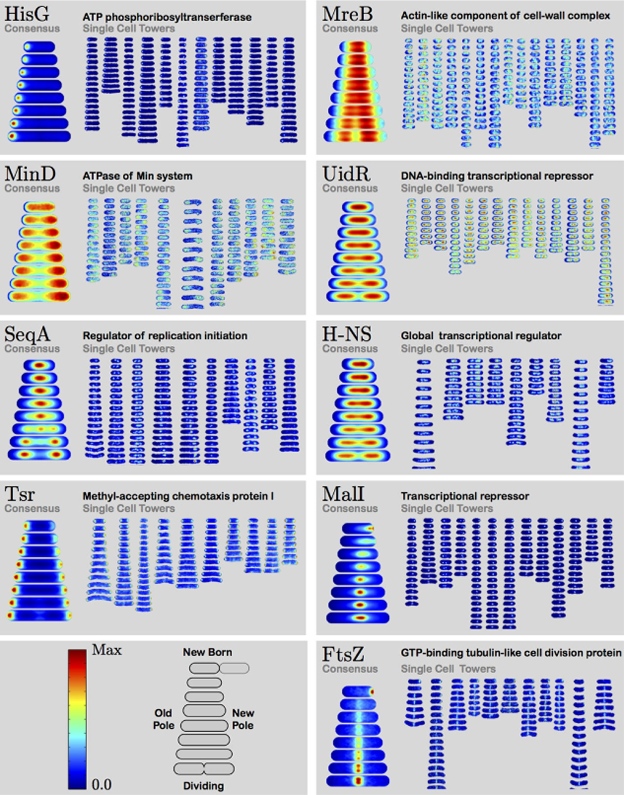

# Next-Frame Prediction using Convolutional LSTM
CSE 599 Final Project - Olivia Thomas and Daniela Koch

## Protein Localization Dynamics in E.coli

It has been observed that the proteins within E.coli exhibit time dependent structure. Some of these proteins have been studied in detail, and it has been found that the observed temporal structure is directly related to their function within the cell.  For example, the protein ftsZ can be found in highest concentrations at the middle of the cell, where it is responsible for the mechanics of cell division [[2]](#2).  We can gain intuition about proteins with unknown function by comparing their dynamical structure throughout the cell to those of proteins with known functions. 

This can be seen clearly in Figure 1 below, which shows the average position of a protein

       

**Figure 1:** Demonstation of structured protein localization dynamics[[1]](#1)

### Our goal
As we see from Figure 1, there is distinct temporal structure in the localization of a given protein throughout the cell cycle. However, those images above are the consensus images across an entire dataset of the same protein, so what we are interested in now is seeing if we can predict the dynamics of protein localization on a single-cell basis. 

- show example of consensus time dependence, now interested in single cell stuff, which is why we are interested in doing this with neual networks
- can we predict cell death? 
- can we predict mutations? 
- which protein dynamics are most indicative of cell health? 

## what is next frame prediction, how does it work?

### Background on ConvLSTM

The convolutional LSTM, first proposed in [1], uses convolutional operations instead of normal matrix operations in a LSTM recurrent network to capture both temporal and spatial dependencies in data. This algorithm has been used in video analysis, as well as in rainfall forecasting [1] and biological age prediction [Nature]. 

In this application, we adapt the pytorch convolutional LSTM implementation developed by https://raw.githubusercontent.com/ndrplz/ConvLSTM_pytorch/master/convlstm.py (ndrplz) to analyze time-dependent cell lifecycles. 

       

**Figure :** Visual Representation of LSTM and associated equaions

**Figure :** Visualization of Convolutional Neural Network

The ConvLSTM uses the same gating structure as a regular LSTM, but includes convolutional operations rather than regular matrix operations. This feature allows the convolutional LSTM to learn both temporal and spatial relationships in the data. Figure X shows a visualization of the ConvLSTM, as well as the euations associated with calculations done in the cell state. Notice the equations are identitical to the regular LSTM equations show in Figure X, except for the convolutional operations (denoted by *). 

 

**Figure :** Visual Representation of Convolution LSTM and associated equations. 

## More detailed problem overview 

### Data 

The data used in this project is part of a publicly available set of 

The images in were segmented using the SuperSegger[[2]](#2) software created by the Wiggins lab. The software and full documentation for the image segmentation can is publicly available and can be found here: https://github.com/wiggins-lab/SuperSegger/wiki. This software allows us to not only automatically segment the i   

**Figure :** Example of automatic cell segmentation performed by SuperSegger [[2]](#2)*

**Figure :** Single-cell lifecycle tracking over time [[2]](#2)*

After all the segmentation, we get images like these.

     

### Data Preprocessing
After segmentation (make all lifecycles same length, cells same size, etc)
Do this to make it easier for network to learn the thing we actually care about, which is the internal dynamics 

-normalizing the cell cycle (size of cell and number of stages in cycle)

**Figure :** Consensus tower normalizes cell shape, size, and lifecycle-length

### Final Data used in network
Our final pre-processed data is comprised of samples each containg the padded images for each stage of the cell-cycle. More specifically, the input to the network is a pytorch tensor containing (bath_size, seq, channels, height, width)

## Our Network

Hyperparameters
- Batch size: 128
- Number of Epochs: 

- Training Samples:
- Validation Samples:
- Test Samples: 
- Image augmentations: horizontal flip, vertical flip, both

## Results

## References
<a id="1">[1]</a> 
Kuwada, N.J., Traxler, B. and Wiggins, P.A. (2015), Protein localization dynamics in bacteria. Molecular Microbiology, 95: 64-79. https://doi.org/10.1111/mmi.12841

<a id="1">[2]</a> 
Stylianidou, S., Brennan, C., Nissen, S.B., Kuwada, N.J. and Wiggins, P.A. (2016), SuperSegger: robust image segmentation, analysis and lineage tracking of bacterial cells. Molecular Microbiology, 102: 690-700. https://doi.org/10.1111/mmi.13486

<a id="3">[3]</a> 
https://papers.nips.cc/paper/2015/file/07563a3fe3bbe7e3ba84431ad9d055af-Paper.pdf

<a id="4">[4]</a> 
https://medium.com/neuronio/an-introduction-to-convlstm-55c9025563a7

<a id="5">[5]</a> 
Rahman, S.A., Adjeroh, D.A. Deep Learning using Convolutional LSTM estimates Biological Age from Physical Activity. Sci Rep 9, 11425 (2019). https://doi.org/10.1038/s41598-019-46850-0

<a id="6">[6]</a> 
https://raw.githubusercontent.com/ndrplz/ConvLSTM_pytorch/master/convlstm.py
