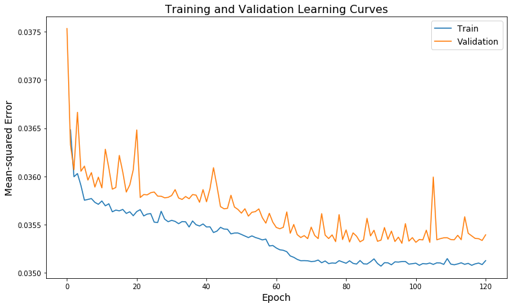
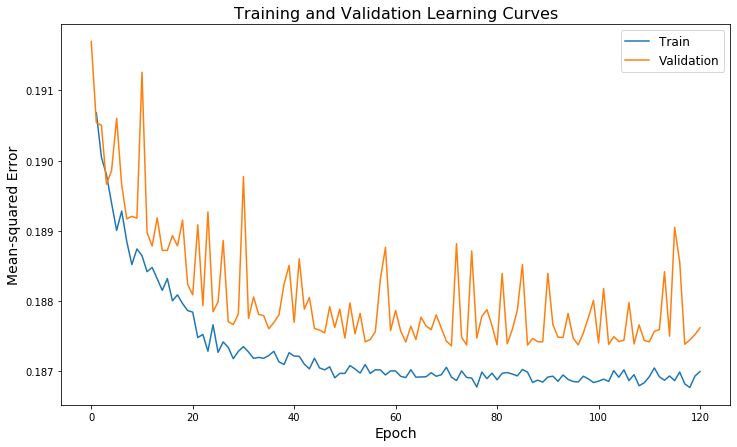
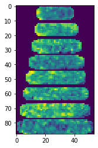
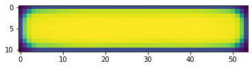
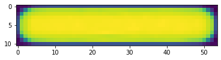

# Next-Frame Prediction using Convolutional LSTM
CSE 599 Final Project - Olivia Thomas and Daniela Koch

## Protein Localization Dynamics in E.coli

It has been observed that the proteins within E.coli exhibit time dependent structure. Some of these proteins have been studied in detail, and it has been found that the observed temporal structure is directly related to their function within the cell. However, due to the vast number of protein types, we know relatively little about the functions of most proteins and it is difficult and time consuming to study them experimentally. Therefore, if we can find methods for predicting their function, we can help guide experimental work. Much of the work with regards to protein function prediction is in the realm of 'protein folding,' which recently made headlines with Google's new AlphaFold2 algorithm. However, there are other indicators for protein function, such as localization dynamics. For example, the protein ftsZ can be found in highest concentrations at the middle of the cell, where it is responsible for the mechanics of cell division [[2]](#2).  We can gain intuition about proteins with unknown function by comparing their dynamical structure throughout the cell to those of proteins with known functions. 

       

**Figure 1:** Demonstation of structured protein localization dynamics[[1]](#1)

### Frame Prediction of Single Cell images
As we see from Figure 1, there is distinct temporal structure in the average localization of a given protein throughout the cell cycle. We are now interested in is seeing if we can predict the dynamics of protein localization on a single-cell basis. If successful, we could use this work to address some of the following questions:

- Can we use localization dynamics to predict cell mutations or cell death? 
- Which proteins are most indicative of cell health?
- Can we quantify the trajectory of internal localization patterns given a specific gene mutation?
- Can we predict the effects of viruses or antibiotics based on internal localization behavior. 

### Our approach
These are all potentially interesting problems, but due to the complexity inherent in biological data, the first step is to see if we can be successful in predicting frames in the simplest possible setting. In the following sections, we walk through the underlying architecture of our network and discuss how we processed the data to reduce the complexity of our problem as much as possible. As this is a brand new project in our research group, we have decided to "start small", increasing network size (and thereby model complexity) only when necessary and doing so with deliberate modifications that make interpetabilty reasonable.

## Background on ConvLSTM

The convolutional LSTM, first proposed in [1], uses convolutional operations instead of normal matrix operations in a LSTM recurrent network to capture both temporal and spatial dependencies in data. This algorithm has been used in video analysis, as well as in rainfall forecasting [1] and biological age prediction [[5]](#5). 

In this application, we adapt the pytorch convolutional LSTM implementation developed by https://raw.githubusercontent.com/ndrplz/ConvLSTM_pytorch/master/convlstm.py (ndrplz) to analyze time-dependent cell lifecycles. 

       

**Figure 2:** Visual Representation of LSTM and associated equaions

**Figure 3:** Visualization of Convolutional Neural Network

The ConvLSTM uses the same gating structure as a regular LSTM, but includes convolutional operations rather than regular matrix operations. This feature allows the convolutional LSTM to learn both temporal and spatial relationships in the data. Figure X shows a visualization of the ConvLSTM, as well as the euations associated with calculations done in the cell state. Notice the equations are identitical to the regular LSTM equations show in Figure X, except for the convolutional operations (denoted by *). 

 

**Figure 4:** Visual Representation of Convolution LSTM and associated equations. 

## More detailed problem overview 

### Data 
Our dataset is comprised of single-cell E.coli images where the protein of interest in each experiment has been marked with fluorescent tags.
The images used were taken by the Wiggins lab in the physics department and is publicly avaialble here: http://mtshasta.phys.washington.edu/aska2/html/gene.html

The images in were segmented using the SuperSegger[[2]](#2) software created by the Wiggins lab. The software and full documentation for the image segmentation can is publicly available and can be found here: https://github.com/wiggins-lab/SuperSegger/wiki. This software allows us to not only automatically segment the i   

**Figure 5:** Example of automatic cell segmentation performed by SuperSegger [[2]](#2)*

**Figure 6:** Single-cell lifecycle tracking over time [[2]](#2)*

After all the segmentation, we get images such as the following.
     

Notice the difference in frame count (due to differences in lifespane) as well as the variance in shape and size. In this particular problem we are not interested in these parameters so we implement some data-preprocessing to eliminate these variables from the data.

### Data Preprocessing
Within SuperSegger, there is a function that allows us to normalize the cell cycle as shown in Figure 7. This function allows us to standardize our dataset by mapping all cells to a standard cycle length with the same size for each step in the cycle. We apply this to all the cells in our data-set to eliminate the variance introduced by having cells of differing size, shape, and lifespan, thus allowing the network to "focus" on the internal dynamics of the cell. 

**Figure 7:** Consensus tower normalizes cell shape, size, and lifecycle-length

### Final Data used in network
Our final pre-processed data is comprised of samples each containg the padded images for each stage of the cell-cycle. More specifically, the input to the network is a pytorch tensor containing (bath_size, seq, channels, height, width)

As the cell images are not oriented in any particular way after the segmentation, we can freely flip them verically or horizonatlly at each time step (as long as were consistent over a given cell) to generate more training data. This allows us to quadruple our data easily without having to preprocess additional training data. 

## Our Network

**Hyperparameters:**

| Layers     | 
| -----------|
| ReLU      | 
| Batchnorm |    
| ConvLSTM | 
| 2d Conv |
  
- Batch size: 128
- Number of Epochs: 120
- Loss Function: Root-Mean-Squared-Error, implemented as torch.sqrt(nn.MSELoss()). We decided to use the square root of the MSE loss because our target pixel values were all between 0 and 1, and MSE penalty gets very small when the absolute value of the error is less than one.  

-Image augmentations: horizontal flip, vertical flip, both
- Number of Samples = 24,000 (96,000 when including transformed images)
- Test:Train split = 20:80 
- Training set was further split into Validation:Train = 20:80 

## Results

We used the mean-squared error and root-mean-squared error for the loss functions for two different experiments. The loss curves and a sample output are shown in Figure X for the mean-squared error experiment. The network is picking up on the most defined feature in the dataset, the outline of the cell. The more subtle features, such as the in the interior of the cell, are not learned by the network (See Figure (TOWER) for comparison). 

**Figure 8:** Learning curve for MSE loss

**Figure 9:** Learning curve for rMSE loss

We then decided to train using a root-mean-squared loss function, aiming to punish high errors more aggressively. Our results show that this change did not improve the prediction capability of the network greatly, see Figure X. 

**Figure 10:** Sample of data (including true final frame)

   

**Figure 11:** Sample output (diffuse protein) using MSE loss (left) rMSE (right)

As discussed previously, this project is in its earliest stages so it is not entirely unexpected that we did immediately succeed in producing a robust frame prediction. However, as seen in the learning curves, the model is, in fact, improving. This can be seen most obviously in the predicted images where the boarder is almost perfect. It seems that, despite our preprocessing, the network still captured information about cell size/shape more successfully than the internal dynamics. 

## Looking Forward

It is clear that we will need to implement a somewhat more sophisticated network in conjunction with the ConvLSTM used in this project.  The following are ideas we did not have time to implement for this project but will be the next steps in our research. 

- Use a 3D convolution on all the outputs, rather than a 2D covolution on the last hidden state
- Make prediction and compute cost for each step in sequence (e.g. for a total sequence length of 8, use first 7 as input and last 7 as 'labels')
- Implement a residual layer to avoid gradient vanishing
- Build encoder and decoder using ConvLSTMcell (an example of this can be found here: https://towardsdatascience.com/video-prediction-using-convlstm-with-pytorch-lightning-27b195fd21a2)
- Provide more input features, such as protein type and any known labels 

## References
<a id="1">[1]</a> 
Kuwada, N.J., Traxler, B. and Wiggins, P.A. (2015), Protein localization dynamics in bacteria. Molecular Microbiology, 95: 64-79. https://doi.org/10.1111/mmi.12841

<a id="1">[2]</a> 
Stylianidou, S., Brennan, C., Nissen, S.B., Kuwada, N.J. and Wiggins, P.A. (2016), SuperSegger: robust image segmentation, analysis and lineage tracking of bacterial cells. Molecular Microbiology, 102: 690-700. https://doi.org/10.1111/mmi.13486

<a id="3">[3]</a> 
https://papers.nips.cc/paper/2015/file/07563a3fe3bbe7e3ba84431ad9d055af-Paper.pdf

<a id="4">[4]</a> 
https://medium.com/neuronio/an-introduction-to-convlstm-55c9025563a7

<a id="5">[5]</a> 
Rahman, S.A., Adjeroh, D.A. Deep Learning using Convolutional LSTM estimates Biological Age from Physical Activity. Sci Rep 9, 11425 (2019). https://doi.org/10.1038/s41598-019-46850-0

<a id="6">[6]</a> 
https://raw.githubusercontent.com/ndrplz/ConvLSTM_pytorch/master/convlstm.py
